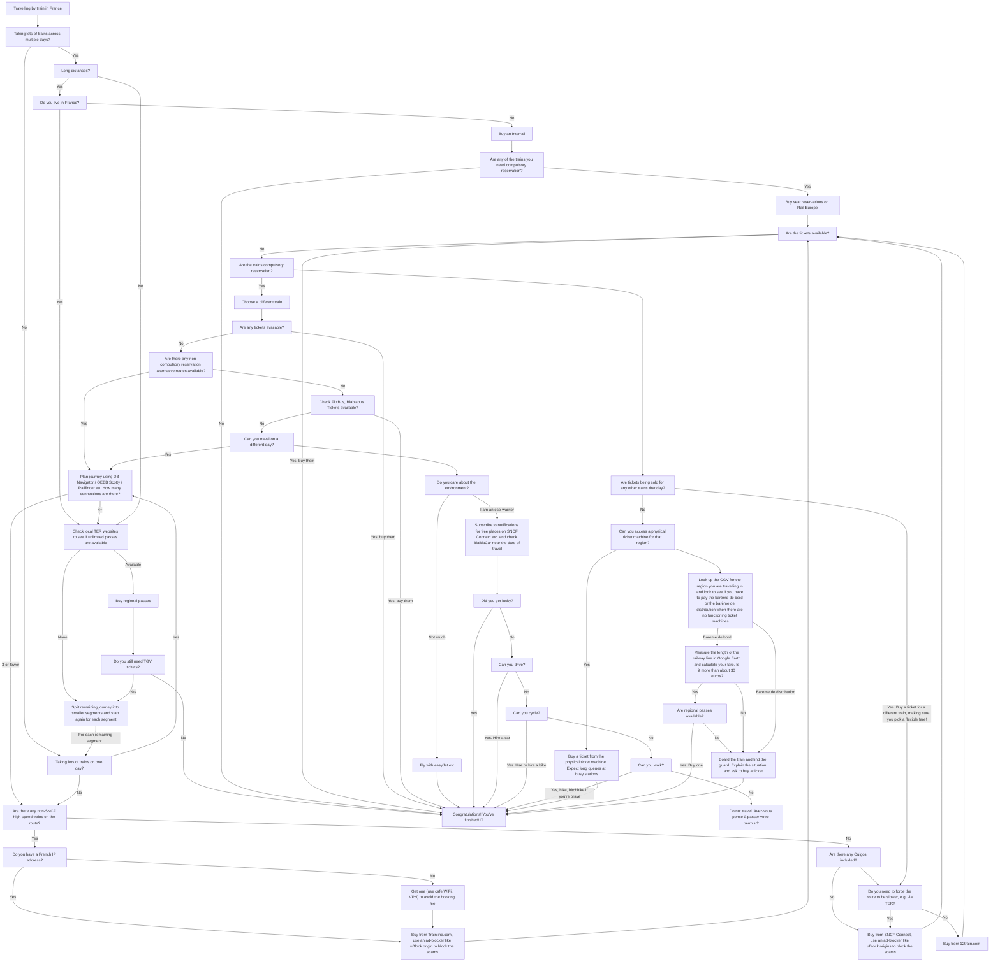

```mermaid
flowchart TD
    n1["Travelling by train in France"] --> n2["Taking lots of trains across multiple days?"]
    n2 -- Yes --> n3["Long distances?"]
    n3 -- Yes --> n4["Do you live in France?"]
    n4 -- No --> n5["Buy an Interrail"]
    n4 -- Yes --> n6["Check local TER websites to see if unlimited passes are available"]
    n6 -- Available --> n7["Buy regional passes"]
    n2 -- No --> n8["Taking lots of trains on one day?"]
    n8 -- Yes --> n9["Plan journey using DB Navigator / OEBB Scotty / Railfinder.eu. How many connections are there?"]
    n9 -- 4+ --> n6
    n10["Split remaining journey into smaller segments and start again for each segment"] -- "For each remaining segment..." --> n8
    n9 -- 3 or fewer --> n11["Are there any non-SNCF high speed trains on the route?"]
    n6 -- None --> n10
    n3 -- No --> n6
    n7 --> n12["Do you still need TGV tickets?"]
    n12 -- Yes --> n10
    n12 -- No --> n13@{ label: "Congratulations! You've finished! 🎉" }
    n5 --> n14["Are any of the trains you need compulsory reservation?"]
    n14 -- No --> n13
    n14 -- Yes --> n15["Buy seat reservations on Rail Europe"]
    n11 -- Yes --> n16["Do you have a French IP address?"]
    n16 -- Yes --> n17["Buy from Trainline.com, use an ad-blocker like uBlock origin to block the scams"]
    n16 -- No --> n18["Get one (use cafe WiFi, VPN) to avoid the booking fee"]
    n18 --> n17
    n11 -- No --> n19["Are there any Ouigos included?"]
    n17 --> n23["Are the tickets available?"]
    n19 -- No --> n20["Buy from SNCF Connect, use an ad-blocker like uBlock origins to block the scams"]
    n19 --> n21["Do you need to force the route to be slower, e.g. via TER?"]
    n21 -- Yes --> n20
    n21 -- No --> n22["Buy from 12train.com"]
    n23 -- Yes, buy them --> n13
    n15 --> n23
    n20 --> n23
    n22 --> n23
    n23 -- No --> n24["Are the trains compulsory reservation?"]
    n24 -- Yes --> n25["Choose a different train"]
    n25 --> n26["Are any tickets available?"]
    n26 -- Yes, buy them --> n13
    n26 -- No --> n27["Are there any non-compulsory reservation alternative routes available?"]
    n27 -- Yes --> n9
    n27 -- No --> n28["Check FlixBus, Blablabus. Tickets available?"]
    n28 -- Yes, buy them --> n13
    n28 -- No --> n29["Can you travel on a different day?"]
    n29 -- Yes --> n9
    n29 --> n30["Do you care about the environment?"]
    n30 -- Not much --> n31["Fly with easyJet etc"]
    n31 --> n13
    n30 -- "I am an eco-warrior" --> n32["Subscribe to notifications for free places on SNCF Connect etc. and check BlaBlaCar near the date of travel"]
    n32 --> n33["Did you get lucky?"]
    n33 -- Yes --> n13
    n33 -- No --> n34["Can you drive?"]
    n34 -- "Yes. Hire a car" --> n13
    n34 -- No --> n35["Can you cycle?"]
    n35 -- "Yes. Use or hire a bike" --> n13
    n35 -- No --> n36["Can you walk?"]
    n36 -- Yes, hike, hitchhike if you're brave --> n13
    n36 -- No --> n37["Do not travel. Avez-vous pensé à passer votre permis ?"]
    n8 -- No --> n11
    n24 --> n38["Are tickets being sold for any other trains that day?"]
    n38 -- "Yes. Buy a ticket for a different train, making sure you pick a flexible fare!" --> n21
    n38 -- No --> n39["Can you access a physical ticket machine for that region?"]
    n39 -- Yes --> n40["Buy a ticket from the physical ticket machine. Expect long queues at busy stations"]
    n40 --> n13
    n39 --> n41["Look up the CGV for the region you are travelling in and look to see if you have to pay the barème de bord or the barème de distribution when there are no functioning ticket machines"]
    n41 -- Barème de bord --> n42["Measure the length of the railway line in Google Earth and calculate your fare. Is it more than about 30 euros?"]
    n42 -- Yes --> n43["Are regional passes available?"]
    n43 -- "Yes. Buy one" --> n13
    n43 -- No --> n44["Board the train and find the guard. Explain the situation and ask to buy a ticket"]
    n44 --> n13
    n42 -- No --> n44
    n41 -- Barème de distribution --> n44
```
